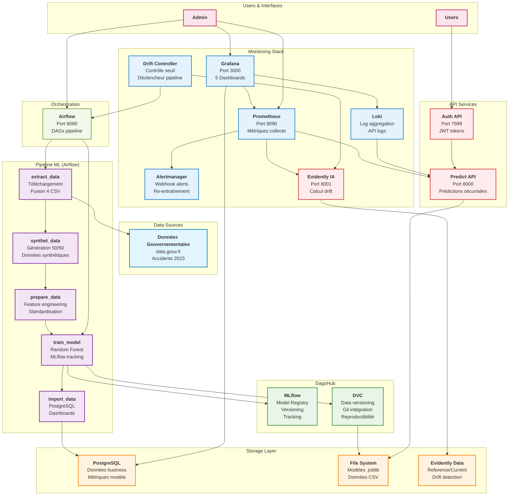

```mermaid
graph TB
    %% Couche Data Sources
    subgraph "Data Sources"
        GOV["`**Données Gouvernementales**
        data.gouv.fr
        Accidents 2023`"]
    end
    %% Couche Pipeline ML
    subgraph "Pipeline ML (Airflow)"
        EXTRACT["`**extract_data**
        Téléchargement
        Fusion 4 CSV`"]
        SYNTHETIC["`**synthet_data**
        Génération 50/50
        Données synthétiques`"]
        PREPARE["`**prepare_data**
        Feature engineering
        Standardisation`"]
        TRAIN["`**train_model**
        Random Forest
        MLflow tracking`"]
        IMPORT["`**import_data**
        PostgreSQL
        Dashboards`"]
    end
    %% Couche MLOps
    subgraph "DagsHub"
        MLFLOW["`**MLflow**
        Model Registry
        Versioning
        Tracking`"]
        DVC["`**DVC**
        Data versioning
        Git intégration
        Reproductibilité`"]
    end
    %% Couche Storage
    subgraph "Storage Layer"
        POSTGRES["`**PostgreSQL**
        Données business
        Métriques modèle`"]
        FILES["`**File System**
        Modèles .joblib
        Données CSV`"]
        EVID_DATA["`**Evidently Data**
        Reference/Current
        Drift detection`"]
    end
    %% Couche API
    subgraph "API Services"
        AUTH["`**Auth API**
        Port 7999
        JWT tokens`"]
        PREDICT["`**Predict API**
        Port 8000
        Prédictions sécurisées`"]
    end
    %% Couche Monitoring
    subgraph "Monitoring Stack"
        PROMETHEUS["`**Prometheus**
        Port 9090
        Métriques collecte`"]
        GRAFANA["`**Grafana**
        Port 3000
        5 Dashboards`"]
        ALERT["`**Alertmanager**
        Webhook alerts
        Re-entraînement`"]
        LOKI["`**Loki**
        Log aggregation
        API logs`"]
        EVID_API["`**Evidently IA**
        Port 8001
        Calcul drift`"]
        DRIFT_CTRL["`**Drift Controller**
        Contrôle seuil
        Déclencheur pipeline`"]
    end
    %% Couche Orchestration
    subgraph "Orchestration"
        AIRFLOW["`**Airflow**
        Port 8080
        DAGs pipeline`"]
    end
    %% Couche Users
    subgraph "Users & Interfaces"
        USERS["`**Users**`"]
        ADMIN["`**Admin**`"]
    end
    %% Flux de données
    EXTRACT --> GOV
    EXTRACT --> SYNTHETIC
    SYNTHETIC --> PREPARE
    PREPARE --> TRAIN
    TRAIN --> IMPORT
    IMPORT --> POSTGRES
    %% MLOps connections
    TRAIN --> MLFLOW
    TRAIN --> DVC
    DVC --> FILES
    %% API flows
    USERS --> AUTH
    AUTH --> PREDICT
    PREDICT --> FILES
    %% Monitoring flows
    PROMETHEUS --> ALERT
    PROMETHEUS --> EVID_API
    PROMETHEUS --> PREDICT
    LOKI --> PREDICT
    GRAFANA --> PROMETHEUS
    GRAFANA --> LOKI
    GRAFANA --> POSTGRES
    %% Drift detection
    EVID_API --> EVID_DATA
    DRIFT_CTRL --> EVID_API
    DRIFT_CTRL --> AIRFLOW
    AIRFLOW --> TRAIN
    %% Orchestration
    AIRFLOW --> EXTRACT
    %% Admin access
    ADMIN --> GRAFANA
    ADMIN --> AIRFLOW
    ADMIN --> PROMETHEUS
    %% Styling
    classDef dataSource fill:#e1f5fe,stroke:#0277bd,stroke-width:2px
    classDef pipeline fill:#f3e5f5,stroke:#7b1fa2,stroke-width:2px
    classDef mlops fill:#e8f5e8,stroke:#388e3c,stroke-width:2px
    classDef storage fill:#fff3e0,stroke:#f57c00,stroke-width:2px
    classDef api fill:#ffebee,stroke:#d32f2f,stroke-width:2px
    classDef monitoring fill:#e3f2fd,stroke:#1976d2,stroke-width:2px
    classDef orchestration fill:#f1f8e9,stroke:#689f38,stroke-width:2px
    classDef users fill:#fce4ec,stroke:#c2185b,stroke-width:2px
    class GOV dataSource
    class EXTRACT,SYNTHETIC,PREPARE,TRAIN,IMPORT pipeline
    class MLFLOW,DVC mlops
    class POSTGRES,FILES,EVID_DATA storage
    class AUTH,PREDICT,EVID_API api
    class PROMETHEUS,GRAFANA,ALERT,LOKI,DRIFT_CTRL monitoring
    class AIRFLOW orchestration
    class USERS,ADMIN users
```
